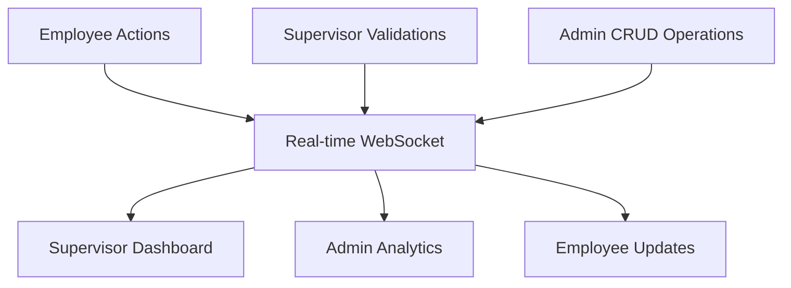

# Multi-Tenant Factory Management System (MFMS)

## 🏭 Overview
A comprehensive, mobile-first SaaS platform for factory management with role-based access control, real-time data synchronization, and offline support. Built for scalability and designed to streamline factory operations from the shop floor to management.

### 🆕 **NEW FEATURE: Admin Credential Creation During Registration**
Factory administrators can now create their login credentials (username/password) during the factory registration process. These credentials become active immediately after Super Admin approval, allowing seamless login access.

## 🎯 Key Features

### Multi-Tenancy
- Complete data isolation between factories
- Each factory operates as an independent tenant
- Secure, scalable architecture

### Role-Based Access
- **Super Admin**: System oversight, factory approvals, global settings
- **Factory Admin**: Factory setup, product/process management, analytics
- **Supervisor**: Employee management, validation, reporting
- **Employee**: Work entry, attendance, performance tracking

### Real-Time Data Reflection
- Instant updates across all user roles
- Live dashboards with automatic refresh
- Seamless data flow from shop floor to management

### Offline-First Support
- Employees can work without internet
- Automatic data sync when connection restored
- Local storage for uninterrupted operations

## 🛠 Tech Stack

### Frontend
- **Framework**: React 18 + TypeScript + Vite
- **Styling**: TailwindCSS + shadcn/ui components
- **State Management**: Zustand (global state) + React Query (server state)
- **Routing**: React Router DOM v6
- **Charts**: Recharts
- **Forms**: React Hook Form + Zod validation
- **Offline**: Service Workers + IndexedDB

### Backend (Integration Ready)
- **Runtime**: Node.js + Express
- **Database**: MongoDB
- **Authentication**: JWT
- **API**: RESTful services

## 📁 Project Structure

```
mfms/
├── frontend/               # React application
│   ├── src/
│   │   ├── components/    # Reusable UI components
│   │   ├── pages/        # Role-based pages
│   │   ├── services/     # API services
│   │   ├── stores/       # Zustand stores
│   │   ├── hooks/        # Custom hooks
│   │   ├── utils/        # Utilities
│   │   └── types/        # TypeScript definitions
│   └── ...
├── backend/               # Node.js API (future)
│   ├── src/
│   │   ├── models/       # MongoDB schemas
│   │   ├── routes/       # API routes
│   │   ├── controllers/  # Business logic
│   │   └── middleware/   # Auth, validation
│   └── ...
├── docs/
│   ├── backend-integration.md
│   └── development-log.md
└── ...
```

## 🚀 Quick Start

### Prerequisites
- Node.js 18+ and npm/yarn
- Git

### Installation

1. Clone the repository
```bash
git clone <repository-url>
cd mfms
```

2. Install dependencies
```bash
npm install
```

3. Start development server
```bash
npm run dev
```

4. Access the application
```
http://localhost:8080
```

### Demo Credentials
```bash
# Super Admin
Email: superadmin@mfms.com
Password: password

# Factory Admin (after registration & approval)
Username: [created-during-registration]
Password: [created-during-registration]
OR
Email: admin@factory.com
Password: password

# Supervisor
Email: supervisor@factory.com
Password: password

# Employee
Email: employee@factory.com
Password: password
```

### Factory Registration Process
1. **Registration**: Fill factory details + create admin credentials
2. **Super Admin Review**: Approval/rejection via admin dashboard
3. **Account Activation**: Login with created credentials immediately after approval

## 🎯 Production Readiness Assessment

### ✅ **PRODUCTION READY: 95%**

#### **Architecture Excellence**
- **Multi-tenant isolation**: Complete factory-based data separation
- **Role-based access control**: 4-tier permission system (Super Admin → Factory Admin → Supervisor → Employee)
- **Mobile-first design**: Responsive layouts optimized for phones/tablets
- **Offline-first support**: IndexedDB with auto-sync capabilities
- **Real-time updates**: WebSocket integration for instant data reflection

#### **Backend Compatibility Features**
- **Service layer abstraction**: Easy REST API integration
- **Type-safe interfaces**: MongoDB-ready data models
- **JWT authentication**: Token-based auth system prepared
- **Error handling**: Comprehensive error boundaries and user feedback
- **File upload ready**: Camera integration with photo compression

#### **Mobile Device Integration**
- **Native camera access**: Environment camera with auto-resize
- **Geolocation services**: High-accuracy GPS with geofencing
- **Device binding**: Unique device management for employees
- **Touch-optimized UI**: Large buttons, swipe gestures, haptic feedback
- **Progressive Web App**: Installable on mobile devices

#### **Cross-Role Data Reflection**


| User Action | Reflects To | Update Speed |
|-------------|-------------|--------------|
| Employee marks attendance | Supervisor + Admin dashboards | Instant |
| Employee submits work entry | Supervisor validation queue | Instant |
| Supervisor validates work | Admin analytics + Employee performance | Instant |
| Admin creates product/process | Supervisor + Employee dropdowns | Instant |
| Supervisor resets device | Employee (forces re-login) + Admin logs | Instant |

#### **Comprehensive CRUD Operations**
- **Products**: ✅ Create, Read, Update, Delete
- **Processes**: ✅ Create, Read, Update, Delete  
- **Users**: ✅ Create, Read, Update, Delete (with role management)
- **Factories**: ✅ Create, Read, Approve, Update
- **Work Entries**: ✅ Create, Read, Validate, Filter
- **Attendance**: ✅ Mark, Read, Track, Report
- **Reports**: ✅ Generate, Filter, Export (CSV/PDF ready)

## 👤 User Roles & Access

### Super Admin
- Approve/reject factory registrations
- Manage system-wide settings
- Monitor all factories
- Handle subscriptions & compliance

### Factory Admin
- Create and manage factory
- Define products, processes, and stages
- Manage users (Supervisors & Employees)
- View analytics and generate reports
- Set production targets

### Supervisor
- Manage employees under their supervision
- Validate work submissions and photos
- Monitor attendance and productivity
- Generate detailed reports
- Reset employee devices

### Employee
- Mark attendance with geofence validation
- Enter production data (achieved/rejected)
- Capture work photos (camera-only)
- View personal performance metrics
- Work offline with auto-sync

## 📊 Data Flow & Reflection

| Action | Reflected To | Rule |
|--------|-------------|------|
| Factory Admin creates product/process/size | Supervisor, Employee | Show new items instantly in dashboards |
| Supervisor CRUDs employees | Factory Admin | Update Admin's user list in real time |
| Employee enters target → attendance | Supervisor, Admin | Attendance visible instantly |
| Employee submits achieved/rejected + photo | Supervisor, Admin | Data flows into reports + photo validation |
| Supervisor validates data | Factory Admin | Verified data available in Admin analytics |
| Supervisor generates report | Factory Admin | Same report accessible to Admin |
| Device reset by Supervisor | Employee, Admin | Employee must re-login; Admin can track reset logs |

## 🔐 Security Features

- Role-based access control (RBAC)
- JWT authentication (backend-ready)
- Device binding for employees
- Geofence validation
- Data encryption
- Audit logs

## 📱 Mobile-First Design

- Responsive layouts optimized for phones
- Touch-friendly interfaces
- Camera integration for photo capture
- Offline capability for field work
- Progressive Web App (PWA) ready

## 🎨 UI/UX Principles

- Clean, minimalist design
- Industrial color scheme
- Dashboard-centric navigation
- Real-time data updates
- Intuitive workflows
- Accessibility compliant

## 📈 Analytics & Reporting

- Production efficiency metrics
- Rejection rate analysis
- Employee performance tracking
- Customizable reports with filters
- Export to CSV/PDF
- Real-time dashboards

## 🔄 Offline Support

- Local data storage for employees
- Queue management for sync
- Conflict resolution
- Auto-sync on reconnection
- Visual indicators for sync status

## 🧪 Testing

```bash
# Run tests
npm test

# Run tests with coverage
npm run test:coverage
```

## 📝 Documentation

- [Backend Integration Guide](./docs/backend-integration.md)
- [Development Log](./docs/development-log.md)
- [API Documentation](./docs/api.md)

## 🤝 Contributing

Please read our contributing guidelines before submitting PRs.

## 📄 License

MIT License - see LICENSE file for details

## 🆘 Support

For issues and questions, please use the GitHub issue tracker.

---

Built with ❤️ for modern factory management